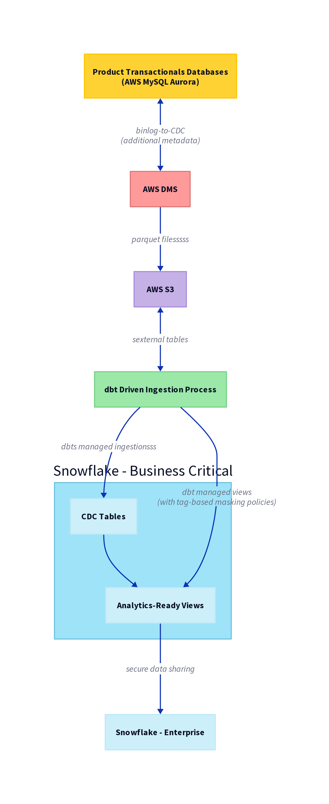
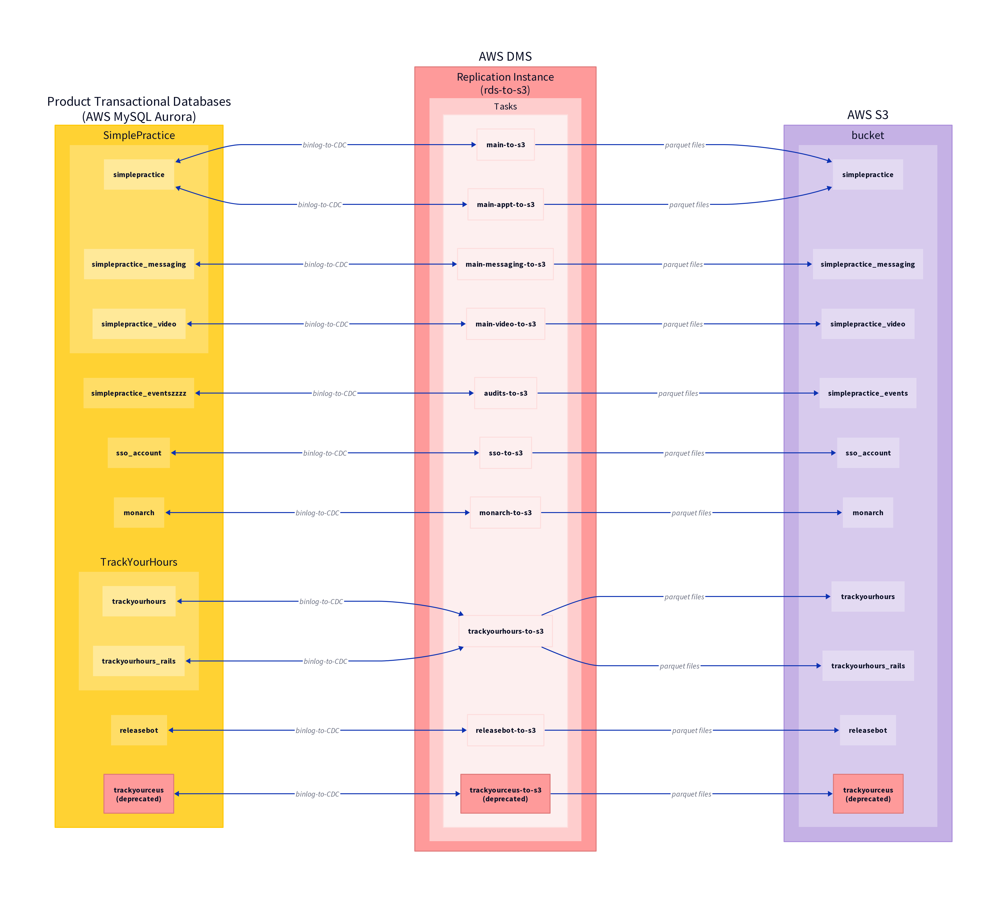
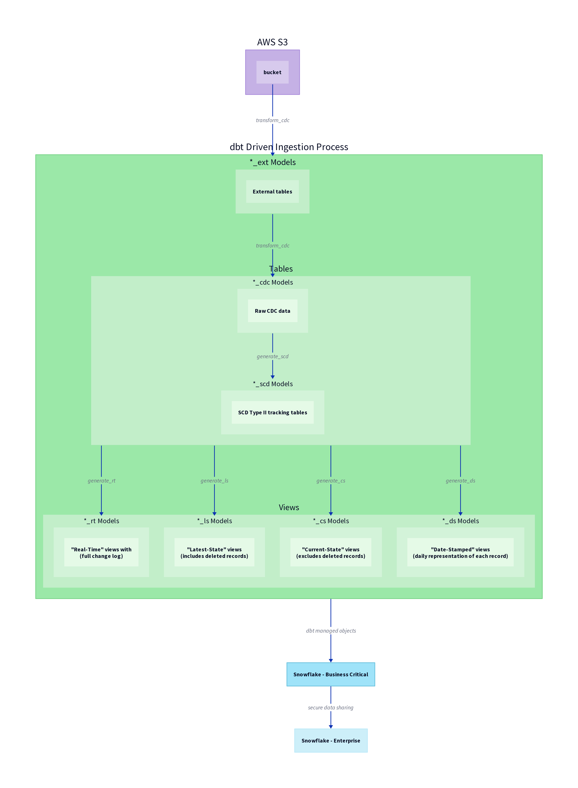

# Product Data Ingestion

## 01 - High Level

Our Product Data Ingestion Pipeline involves several components:

- **AWS DMS**: We use [AWS DMS](https://aws.amazon.com/dms/features/) as a Change Data Capture engine. DMS is configured to read the production application databases' transaction logs for change-data events. These events are captured and can be sent to a variety of targets. In our configuration, DMS sends these CDC messages in parquet format to S3.
    
- **AWS S3 Bucket**: AWS DMS emits batches of CDC messages to S3
    - Files are stored in parquet format
    - bucket is partitioned by `source_database/source_table/yyyy/mm/dd/hh` for performance
    
- **dbt Ingestion Process**: The ingestion of the CDC messages into Snowflake and subsequent transformation of the data into analytics-ready views is driven by dbt.

- **Data Masking**: We utilize Snowflake's [Tag Based Masking](https://docs.snowflake.com/en/user-guide/tag-based-masking-policies) to mask PHI and PII. Tags are applied to views, masking policies are applied to the raw data based on the value of the tag, and finally those views are shared out to the Enterprise account.
    
    [Product Data Ingestion - Data Governance - Tag Based Masking](https://www.notion.so/Product-Data-Ingestion-Data-Governance-Tag-Based-Masking-f70882c02af64b94bb5c9d5bf7560316?pvs=21)
    
- **Data Sharing**: The views are shared to the Standard Snowflake Account utilizing Snowflake's [Secure Data Sharing](https://docs.snowflake.com/en/user-guide/data-sharing-intro) features

For more information visit our [High Level Architecture page on Notion](https://www.notion.so/simplepractice/Product-Data-Ingestion-Technical-High-Level-Architecture-1abf2f8242f180edb541e5dc830d7c82)

---

## 02 - Dms

AWS Database Migration Service (AWS DMS) is a fully-managed cloud service that makes it easy to migrate relational databases, data warehouses, NoSQL databases, and other types of data stores. With AWS DMS, you can perform one-time migrations, and/or replicate ongoing changes.

For our use-case, we primarily use DMS as a Change Data Capture engine. DMS is configured to read the production application databases' transaction logs for change-data events. These events are captured and can be sent to a variety of targets. In our case, DMS logs these CDC messages to parquet files in S3.  Once we have CDC data in S3, we can query it directly from Snowflake and transform it in a variety of ways.

test

For more information visit our [DMS page on Notion](https://www.notion.so/simplepractice/Product-Data-Ingestion-What-is-AWS-DMS-Why-AWS-DMS-8fc9be0f9f634f298c46589650ab16a9)

---

## 03 - Dbt Macros

In the simplepractice-cdc-dbt project, we need to create multiple models for each source table. To optimize this process and reduce manual effort, we’ve created several custom dbt macros which dynamically generate the SQL for these models during runtime. This approach allows us to define most of our models of a specific type uniformly simply by invoking the corresponding macro.

test

For more information visit our [simplepractice-cdc-dbt dbt Macros page on Notion](https://www.notion.so/simplepractice/Product-Data-Ingestion-What-is-AWS-DMS-Why-AWS-DMS-8fc9be0f9f634f298c46589650ab16a9)

---

## 04 - Data Flow

At a high level, we access the files that DMS stages in S3 via Snowflake external tables, then that data is ingested into Snowflake in *_cdc schemas, and then further transformed into various other objects (views) by way of a dbt-driven ingestion process.

For more information visit our [simplepractice-cdc-dbt Data Flow page on Notion](https://www.notion.so/simplepractice/Product-Data-Ingestion-simplepractice-cdc-dbt-Data-Flow-and-Layout-bb30782d359d4879a668094e7e5d0502)

